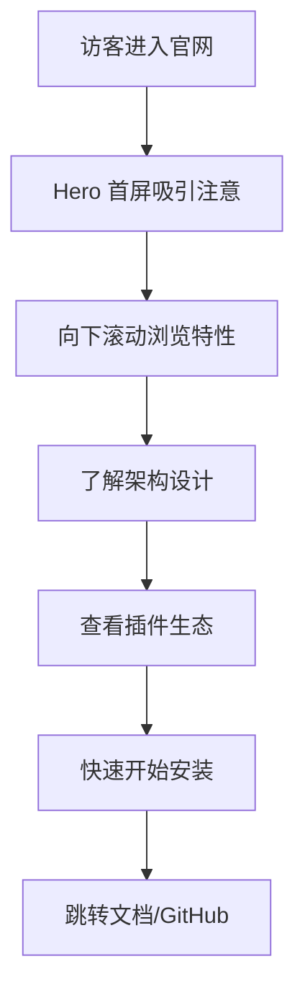

## 1. 产品概述

Qtine 官网是 Qtine 模块化 QQ 机器人框架的品牌展示站，面向开发者群体，以苹果官网式的极致简约风格传达产品价值、核心特性与技术架构，引导开发者快速了解并开始使用。

- 主要目的：品牌展示、功能介绍、快速上手引导
- 目标用户：QQ 机器人开发者、Python/Flask 生态开发者
- 品牌定位：简洁、现代、专业的开源框架

## 2. 核心功能

### 2.1 用户角色

| 角色 | 说明 |
|------|------|
| 访客 | 浏览官网、了解产品功能 |

### 2.2 功能模块

1. **Hero 首屏**: 产品名称、Slogan、CTA 按钮、动态背景
2. **特性展示区**: 6 大核心特性卡片，配合图标与描述
3. **架构概览区**: 可视化展示 Qtine 的消息处理流程
4. **插件生态区**: 展示插件体系与市场集成
5. **WebUI 展示区**: 管理后台截图轮播或静态展示
6. **快速开始区**: 安装命令、文档链接
7. **底部导航**: Logo、链接、版权信息

### 2.3 页面详情

| 页面名称 | 模块名称 | 功能描述 |
|----------|----------|----------|
| 首页（单页） | Hero 首屏 | 全屏展示产品名称"S"、Slogan"模块化 · 热加载 · 高性能"，渐入动画，下拉箭头引导 |
| 首页 | 特性展示 | 6 张卡片网格：插件热加载、消息管道、事件总线、双协议 WebSocket、WebUI 管理后台、插件市场，每张卡片含图标+标题+描述，滚动触发渐入 |
| 首页 | 架构概览 | 简化版消息流示意图，CSS 绘制的流程节点 + 箭头连接，展示"消息接收 → 插件管道 → 回复发送" |
| 首页 | 插件生态 | 展示内置插件（help/echo/admin/ban/repeat/welcome）徽标墙 + 市场集成说明 |
| 首页 | WebUI 展示 | 管理后台界面静态展示区域，展示仪表盘/插件/市场等页面的截图 |
| 首页 | 快速开始 | 两栏布局：左侧 pip 安装命令代码块 + 右侧文档/Roadmap 链接卡片 |
| 首页 | 页脚 | GitHub Star 数量、开源协议、链接导航（文档/GitHub/插件市场） |

## 3. 核心流程

## 4. 用户界面设计

### 4.1 设计风格

- **主色调**: 深色背景 `#0a0a0a`，品牌紫 `#D0BCFF` 作为强调色
- **辅助色**: 卡片背景 `#1a1a2e`，文字 `#e6e1e5` / `#cac4d0`，绿色点缀 `#7DD78D`
- **按钮风格**: 胶囊形圆角按钮，半透明边框 + hover 填充
- **字体**: 标题使用 SF Pro Display（系统字体），正文 SF Pro Text，代码块使用 SF Mono
- **布局风格**: 单页滚动，垂直分区，大留白，居中内容最大宽度 1200px
- **图标**: SVG 线性图标，统一 24x24 viewBox

### 4.2 页面设计概览

| 页面名称 | 模块名称 | UI 元素 |
|----------|----------|---------|
| 首页 | Hero 首屏 | 全屏高度，居中大标题（字号 72px），副标题 24px，CTA 按钮×2（快速开始/查看文档），动态粒子/光晕背景，底部向下箭头动画 |
| 首页 | 特性展示 | 3×2 卡片网格，每张卡片：40px 图标 + 标题 + 描述文字，hover 时微上浮 + 边框亮起 |
| 首页 | 架构概览 | 中央流程图示：圆角矩形节点 + 箭头连线，CSS 动画展示数据流动 |
| 首页 | 插件生态 | 标签徽标墙（flex wrap），hover 变色 |
| 首页 | WebUI 展示 | 横向卡片，深色浏览器窗口模型展示截图占位 |
| 首页 | 快速开始 | 左右分栏，左：深色代码块（pip install qtine），右：链接卡片 |
| 首页 | 页脚 | 三列链接 + 底部版权 |

### 4.3 响应式

- 桌面端优先（1200px 居中）
- 平板 ≤768px：卡片 2 列 → 1 列，标题字号缩小
- 手机 ≤480px：Hero 标题 36px，全部单列堆叠

### 4.4 动画策略

- Hero 标题逐字/逐行渐入（CSS animation-delay）
- 滚动触发卡片入场：Intersection Observer + CSS transition
- 卡片 hover：translateY(-4px) + border-color 过渡
- 按钮 hover：背景渐变动画
- 架构图流程线 pulse 动画
- 页面整体使用 CSS scroll-behavior: smooth
