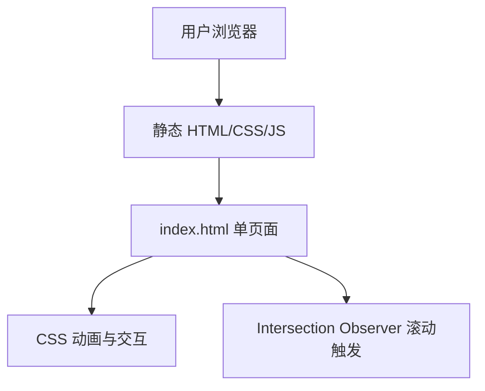

## 1. 架构设计



纯静态站点，无需后端。所有内容为静态 HTML + CSS + JS，可部署到任意静态托管（GitHub Pages / Vercel / 自有服务器）。

## 2. 技术选型

- **前端**: 纯 HTML5 + CSS3 + Vanilla JS（无框架依赖，零构建步骤）
- **字体**: 系统原生字体栈（SF Pro / Segoe UI / PingFang SC）
- **图标**: 内联 SVG（无外部图标库依赖）
- **部署**: 单文件静态 HTML，可直接打开或部署到任意静态服务

## 3. 文件结构

```
website/
├── index.html          # 主页面（单文件包含所有 CSS + JS）
└── README.md           # 部署说明（可选）
```

## 4. 页面路由

| 锚点 | 对应区域 |
|------|----------|
| `#hero` | Hero 首屏 |
| `#features` | 特性展示 |
| `#architecture` | 架构概览 |
| `#ecosystem` | 插件生态 |
| `#webui` | WebUI 展示 |
| `#quickstart` | 快速开始 |

## 5. 数据模型

无后端数据。所有内容为静态硬编码。外部链接：
- GitHub: `https://github.com/QtineNiko/Qtine`
- 文档: 预留文档链接
- 插件市场: 预留市场链接

## 6. 部署方案

- 直接使用浏览器打开 `index.html`
- 或部署至 GitHub Pages：仓库 Settings → Pages → 选择分支
- 或部署至自有服务器的静态目录
